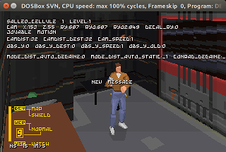

# Fade To Black (DOS) Technical Notes

## Debug information

The executable contains debug strings meant to displayed over the game graphics.

The code is toggled by a variable that cannot be set by the player in
the demo or retail executables.

```asm
cseg01:0002B468    cmp    _debug_messages, 0
cseg01:0002B46F    jz     loc_2B6B4
```

By patching the x86 code (`jnz` or `nop`), theses messages can be displayed.

<figure style="text-align: center;">
    
    <figcaption>Figure 1: Fade to Black in DOSBox displaying debug text</figcaption>
</figure>

## Logging

The executable contains some left over code to log information to a secondary
screen (`@0xb0000`).

The code detects the presence of the screen by writing a character and
reading it back.

```asm
cseg01:00014F45    mov     dx, 3B4h
cseg01:00014F49    mov     al, 0Fh
cseg01:00014F4B    out     dx, al
cseg01:00014F4C    inc     dx
cseg01:00014F4E    in      al, dx
cseg01:00014F4F    mov     ah, al
cseg01:00014F51    mov     al, 'O'
cseg01:00014F53    out     dx, al
cseg01:00014F54    mov     ecx, 100
cseg01:00014F59 loc14F59:
cseg01:00014F59    loop    loc14F59
cseg01:00014F5B    in      al, dx
cseg01:00014F5C    xchg    al, ah
cseg01:00014F5E    out     dx, al
cseg01:00014F5F    cmp     ah, 'O'
cseg01:00014F62    jz      short loc14F73
cseg01:00014F64    xor     eax, eax
cseg01:00014F72    retn
cseg01:00014F73 loc14F73:
cseg01:00014F73    mov     eax, 1
cseg01:00014F78    retn
```

Enabling status messages can be achieved by passing `-ghijklmnop` as an argument
to `DELPHINE.EXE`.

The demo and retail executables have little information left logged, mostly related to
the frame rate when playing cutscenes.

```
FADE TO BLACK - Demo version, 27 june 1995
Copyright (c) Delphine Software, France, 1993-1995
0 im/s fr 1 9 sz 13570
0 im/s fr 1 9 sz 13570
30 im/s fr 1 9 sz 3332
29 im/s fr 1 9 sz 3332
20 im/s fr 1 9 sz 3332
21 im/s fr 1 9 sz 3332
```